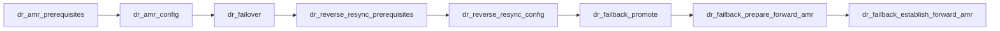

[](https://github.com/NetApp/netapp.trident_protect/actions)

# Ansible Validated Content Collection for NetApp Trident Protect

This collection includes a variety of validated Ansible Roles to automate and manage Day-2 use cases involving NetApp Trident Protect in a Red Hat OpenShift Virtualization environment. It covers common application data management workflows such as Backup and Restore, Snapshot scheduling and Restore, and Disaster Recovery (SnapMirror Replication, Failover, Failback, and Reverse Resync).

## Dependencies

This collection uses the [kubernetes.core](https://galaxy.ansible.com/ui/repo/published/kubernetes/core)
certified Ansible collection to manage Kubernetes objects such as Applications,
AppVaults, Backups, Snapshots, SnapshotSchedules, and Replication resources via
the NetApp Trident Protect custom resources.

## Tested with Ansible

This collection has been tested with ansible-core >= 2.16.0.

## Using this collection

### Installing the Collection from Ansible Galaxy

Before using this collection, you need to install it with the Ansible Galaxy
command-line tool:

```bash
ansible-galaxy collection install netapp.trident_protect
```

You can also include it in a `requirements.yml` file and install it with
`ansible-galaxy collection install -r requirements.yml`, using the format:

```yaml
---
collections:
  - name: netapp.trident_protect
```

Note that if you install the collection from Ansible Galaxy, it will not be upgraded automatically when you upgrade the `ansible` package. To upgrade the collection to the latest available version, run the following command:

```bash
ansible-galaxy collection install netapp.trident_protect --upgrade
```

You can also install a specific version of the collection, for example, if you need to downgrade when something is broken in the latest version (please report an issue in this repository). Use the following syntax to install a specific version, for example `1.0.0`:

```bash
ansible-galaxy collection install netapp.trident_protect:==1.0.0
```

See [using Ansible collections](https://docs.ansible.com/ansible/devel/user_guide/collections_using.html) for more details.

## Role Execution Order / Workflows

The collection ships several roles that are designed to be composed into
end-to-end workflows. Each role's README documents its inputs in detail; the
diagrams below show the order in which roles are typically run.

### Common prerequisite

The [`trident_protect_common`](roles/trident_protect_common/README.md) role
creates the shared objects (Secret, AppVault, Application CR, VM/PVC labels)
that the Backup/Restore and Snapshot/Restore scenarios depend on. Run it once
per cluster before the scenario roles below.

### Backup and Restore workflow

1. [`trident_protect_common`](roles/trident_protect_common/README.md) — create Secret, AppVault, Application, label VMs/PVCs.
2. [`backup_and_restore_scenario`](roles/backup_and_restore_scenario/README.md) — on-demand backup and restore.

### Snapshot and Restore workflow

1. [`trident_protect_common`](roles/trident_protect_common/README.md) — create Secret, AppVault, Application, label VMs/PVCs.
2. [`create_snapshot_schedule`](roles/create_snapshot_schedule/README.md) — create the periodic snapshot `Schedule` CR.
3. *(wait for the schedule to produce at least one snapshot)*
4. [`snapshot_and_restore_scenario`](roles/snapshot_and_restore_scenario/README.md) — restore VMs from the latest snapshot.

### Disaster Recovery (AppMirrorRelationship) workflow

The DR roles are designed to be executed in sequence across the source and
destination OpenShift clusters. The full lifecycle (replication → failover →
reverse resync → failback) is:

1. [`dr_amr_prerequisites`](roles/dr_amr_prerequisites/README.md) — set up secrets, AppVaults, Application, and snapshots on source and destination clusters.
2. [`dr_amr_config`](roles/dr_amr_config/README.md) — create the `AppMirrorRelationship` (AMR) to start replication.
3. [`dr_failover`](roles/dr_failover/README.md) — fail over the replicated application to the destination cluster after a disaster on the source.
4. [`dr_reverse_resync_prerequisites`](roles/dr_reverse_resync_prerequisites/README.md) — validate/prepare the new source (original destination) cluster for reverse resync.
5. [`dr_reverse_resync_config`](roles/dr_reverse_resync_config/README.md) — reverse resync the AMR so replication flows back toward the original primary.
6. [`dr_failback_promote`](roles/dr_failback_promote/README.md) — promote the AMR on the original source to initiate failback of VMs.
7. [`dr_failback_prepare_forward_amr`](roles/dr_failback_prepare_forward_amr/README.md) — prepare to re-establish forward replication from the original primary.
8. [`dr_failback_establish_forward_amr`](roles/dr_failback_establish_forward_amr/README.md) — re-establish the forward AMR from original source to destination, completing failback.



> Note: Steps 3–8 are only required if a disaster (or planned failover) and
> subsequent failback are exercised. Steady-state replication only needs
> steps 1–2.

## Release notes

See the [changelog](https://github.com/NetApp/netapp.trident_protect/tree/main/changelogs/changelog.rst).

## More information

* [NetApp Trident Protect documentation](https://docs.netapp.com/us-en/trident/trident-protect/learn-about-trident-protect.html)
* [kubernetes.core Ansible collection](https://galaxy.ansible.com/ui/repo/published/kubernetes/core)
* [Ansible user guide](https://docs.ansible.com/ansible/devel/user_guide/index.html)
* [Ansible developer guide](https://docs.ansible.com/ansible/devel/dev_guide/index.html)
* [Ansible collections requirements](https://docs.ansible.com/ansible/devel/community/collection_contributors/collection_requirements.html)
* [Ansible community Code of Conduct](https://docs.ansible.com/ansible/devel/community/code_of_conduct.html)
* [The Bullhorn (the Ansible contributor newsletter)](https://docs.ansible.com/ansible/devel/community/communication.html#the-bullhorn)
* [Important announcements for maintainers](https://github.com/ansible-collections/news-for-maintainers)
